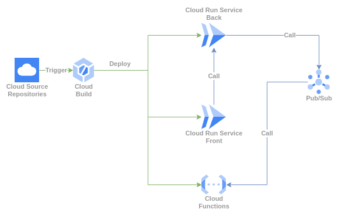

# Demo Front

Buildar Imagem docker:

```bash
docker build -t demo-front:latest .
```

Executar imagem docker localmente:

```bash
docker run -t -p 8080:8080 --env BACK_END_URL=http://localhost:8000 front-demo:v1
```

""
