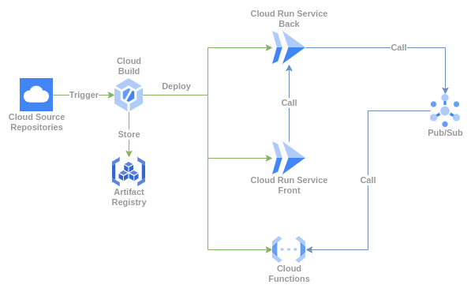

# Demo Front

Buildar Imagem docker:

```bash
docker build -t $REGION-docker.pkg.dev/$PROJECT_ID/$REPOSITORY/front-demo:$LABEL .
```

Executar imagem docker localmente:

```bash
docker run -t -p 8080:8080 \
	--env BACK_END_URL=$BACK_URL \
	$REGION-docker.pkg.dev/$PROJECT_ID/$REPOSITORY/front-demo:$LABEL
```

Enviar ao Artifact Registry:

```bash
docker push $REGION-docker.pkg.dev/$PROJECT_ID/$REPOSITORY/front-demo:$LABEL
```

Deploy da imagem no GCP:

```bash
gcloud run deploy front-demo \
	--image $REGION-docker.pkg.dev/$PROJECT_ID/$REPOSITORY/front-demo:$LABEL \
	--region $REGION
```




Testar Localmente:

```bash
docker build -t front-demo:latest && \
docker run -t -p 8080:8080 \
	--env BACK_END_URL=http://localhost:8000 \
	front-demo:latest
```
